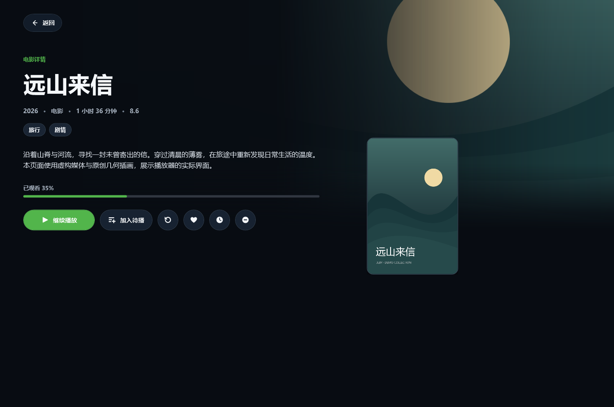
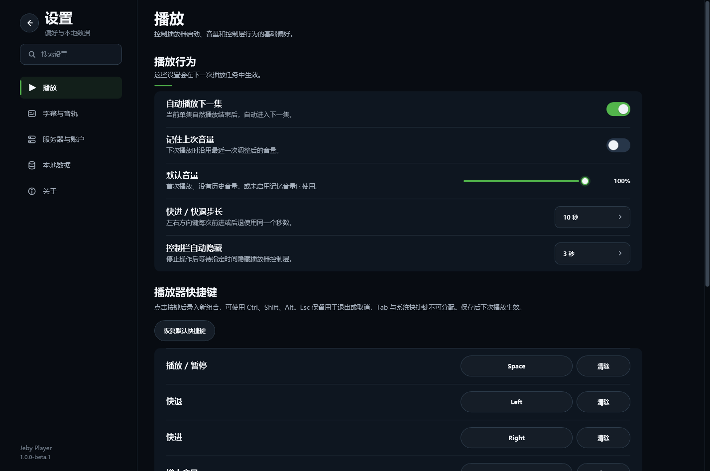

# Jeby Player

**适用于 Windows 的 Emby 桌面播放器。**  
An Emby desktop player for Windows, built with WPF and MPV.

Jeby Player 连接你自己的 Emby Server，让你在桌面浏览媒体库、查看电影和剧集详情、继续观看并播放视频。界面以深色为主，使用原生 Windows 窗口和 MPV 播放内核。

目前处于早期测试阶段。当前支持 Emby；Jellyfin 支持列入后续计划，尚未实现。

## 界面预览

以下截图来自实际 WPF 界面，使用虚构的演示账号、片名和原创示例海报，不代表附带影视内容。

### 首页


### 影片详情



### 设置



## 主要功能

- 连接 Emby 服务器、登录账号，切换最近使用的服务器。
- 浏览电影与剧集，搜索媒体和演职人员，查看详情、艺术图及类似作品。
- 继续观看、收藏、稍后观看和播放队列。
- 播放进度同步、字幕与音轨切换、画质选择、倍速及长按加速。
- 全屏与小窗播放、可配置快捷键、进度条画面预览。
- 默认字幕偏好、本地字幕导入、字幕时间和位置调整。

内容、字幕、章节以及直连或转码方式取决于服务器、账号权限和媒体本身。服务器没有预览图时，客户端可在本机按需生成，首次加载速度受视频与网络影响。

## 使用前需要什么

- Windows 10 或 Windows 11，x64。
- 一台可访问的 Emby Server，以及有权播放媒体的账号。
- 服务器地址和你的登录信息。

启动后输入服务器地址并登录，即可从首页或媒体库选择影片。Jeby Player 不提供影片、服务器账号或订阅内容，也不是 Emby 或 Jellyfin 的官方产品。

## 反馈问题

请记录 Windows 版本、应用版本、Emby Server 版本、复现步骤和预期结果。可在设置中导出诊断日志，分享前检查并移除私人服务器地址、令牌、账号和个人路径。详细格式见 [问题反馈模板](docs/BUG_REPORT_TEMPLATE.md)。

## 从源码运行

开发需要 Windows 和 .NET SDK；[global.json](global.json) 当前选择 `10.0.303`，允许同一 feature band 的更新补丁。应用目标框架为 .NET 8 WPF，运行应用还需要 x64 .NET 8 Desktop Runtime（仅安装 .NET 10 SDK 不会提供这个运行时）。

没有 MPV DLL 也可构建应用并使用浏览界面；实际播放需要 `src/EmbyPlayer.App/runtimes/win-x64/native/libmpv-2.dll`。当前仓库记录的 MPV 二进制来源和许可证证据尚不完整；请先阅读 [发布准备与 MPV 限制](docs/PUBLIC_RELEASE.md)。

在仓库根目录执行：

```powershell
dotnet restore EmbyPlayer.sln --locked-mode --disable-parallel
dotnet build EmbyPlayer.sln --no-restore
.\scripts\run-app.ps1
```

完整验证使用 `.\scripts\build-test.ps1`；其中发布管线测试需要上述 MPV DLL，无 DLL 的源码环境可先构建和浏览界面。

源码项目、可执行文件和现有设置/凭据存储暂时沿用 `EmbyPlayer` 标识，产品展示名称为 **Jeby Player**。保留这些内部标识是为了兼容旧版本，避免更名导致设置丢失或要求重新登录。

## 项目文档

- [公开发布准备、内部打包与部署](docs/PUBLIC_RELEASE.md)
- [品牌名称与使用规范](docs/brand-guidelines.md)
- [第三方组件与素材清单](docs/THIRD_PARTY_NOTICES.md)
- [更新记录](CHANGELOG.md)
- [产品需求](docs/REQUIREMENTS.md) · [界面规范](docs/UI_SPEC.md)
- [播放器规范](docs/PLAYER_SPEC.md) · [API 规范](docs/API_SPEC.md)
- [测试与验收](docs/TEST_PLAN.md)

后续顺序：统一品牌 → 完成公开发布准备 → 发布 Emby 测试版 → 增加 Jellyfin 支持。

## 许可证与第三方组件

Jeby Player 的自有项目代码采用 **GNU GPL 第 3 版或后续版本**（`GPL-3.0-or-later`），完整条款见 [LICENSE](LICENSE)。

第三方组件保留各自适用的许可。项目选择 GPL 并不代表当前 MPV 二进制已具备完整分发证据；MPV 及其他第三方组件的来源、许可证和随包材料仍需要在公开发布前完成核验，详见 [发布清单](docs/PUBLIC_RELEASE.md)。
