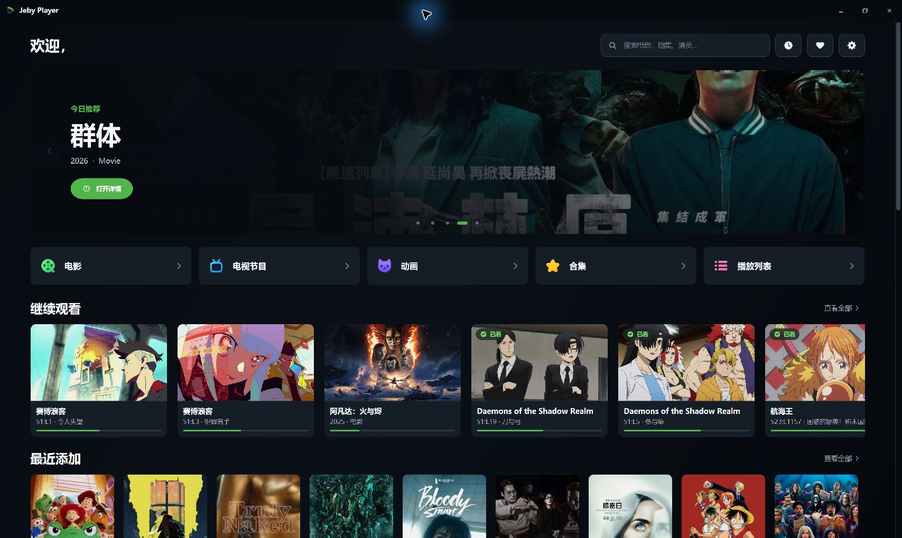
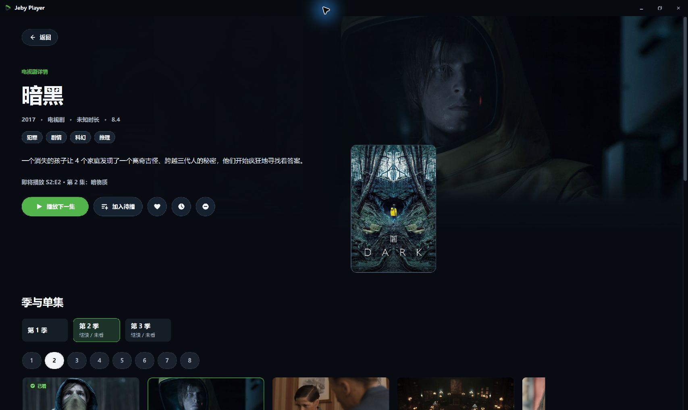
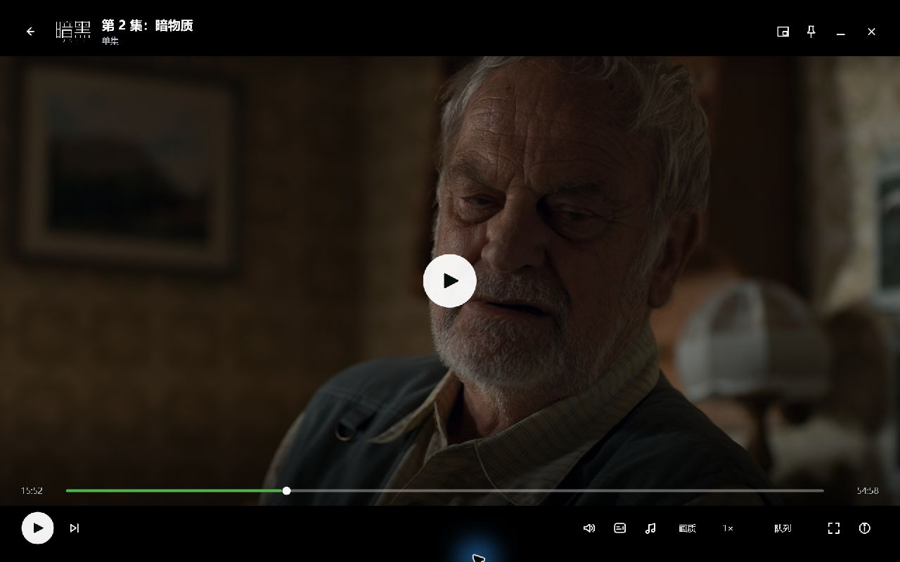

# Jeby Player 1.0.0-beta.1

Jeby Player 是一个适用于 Windows 的 Emby 桌面播放器，采用原生 WPF 界面和 MPV 播放内核。连接自己的 Emby 服务器后，可以浏览媒体、继续观看，并在独立播放窗口中观看视频。

这是首个公开测试版本。当前支持 Emby，尚不支持 Jellyfin。

## 主要功能

- 首页聚合媒体库、继续观看与最近添加；支持搜索、排序和筛选。
- 电影与电视剧详情，包含演职人员、艺术图和类似作品（以服务器提供的数据为准）。
- 收藏、稍后观看、播放队列，以及服务器间切换。
- 播放进度同步、字幕与音轨切换、默认字幕偏好、本地字幕导入和字幕调整。
- 全屏、小窗、倍速与长按加速；支持进度条画面预览和可配置快捷键。
- 深色界面，统一的图标和详情操作布局。

## 产品截图

截图来自连接实际媒体库的应用。影片名称、海报和播放画面保留，个人账号信息已遮盖；应用不附带影片。

## 使用说明

1. 下载 `JebyPlayer-1.0.0-beta.1-win-x64-selfcontained.zip`。
2. 完整解压到可写目录，运行 `EmbyPlayer.App.exe`。不要直接在压缩包内运行。
3. 输入自己的 Emby 服务器地址并登录。

该包自带 .NET 8 和 MPV，无需单独安装运行时。`mpv-corresponding-sources.zip` 为内核及依赖的对应源码附件，普通使用无需下载。`SHA256SUMS.txt` 用于核对下载文件完整性。

适用于 Windows 10 / 11 x64。应用不提供影片、Emby 服务器、账号或订阅。连接自己有权使用的服务器后登录即可浏览媒体。

首次使用建议先测试常用影片的播放、字幕、音轨切换和退出后的进度恢复。服务器没有预览图时，客户端可在本机按需生成，首次显示速度受视频和网络影响。

## 反馈与许可

本地 Release 构建零警告、零错误，1,698 项自动化测试全部通过，发布包窗口启动检查通过。新 MPV 运行时另已验证本地视频和带认证头的 HTTP 播放、暂停、跳转、音轨、字幕导入与预览；不同服务器的 HTTPS、转码及硬件组合仍需要实际反馈。

欢迎通过仓库 Issues 反馈，附应用版本、Windows 版本和复现步骤。请勿公开服务器地址、令牌、密码或私人媒体信息。

项目自有代码采用 GPL-3.0-or-later；第三方组件遵循各自许可。Jeby Player 是独立第三方客户端，与 Emby 或 Jellyfin 没有官方隶属关系。
